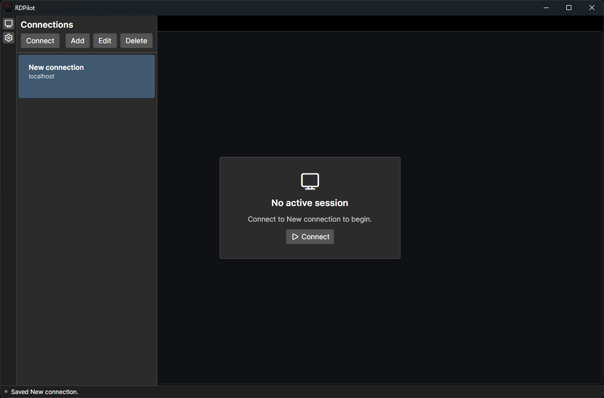

# RDPilot

<p align="center">
  
</p>

RDPilot is a fast Avalonia RDP client backed by FreeRDP. It focuses on responsive remote desktop sessions, dynamic resolution, secure saved profiles, and a clean tabbed interface.

RDPilot currently supports Windows and Linux.

<p align="center">
  
</p>

## Features

- Dynamic resolution when the client window changes size.
- Low-latency keyboard and mouse input with mouse-move coalescing.
- Keyboard grab (Windows only) so `Win`, `Alt+Tab`, `Ctrl+Esc` and other shell chords go to the remote session instead of the local desktop, plus a toolbar action to send `Ctrl+Alt+Del`.
- Multiple simultaneous RDP sessions through tabs.
- Saved connection profiles with passwords stored in the OS credential vault.
- Text clipboard sync between local and remote sessions.
- Per-connection and global quality settings for color depth, font smoothing, wallpaper, themes, animations, full-window drag, compression, bitmap cache, and connection type.

## Install

Install on Windows with winget:

```powershell
winget install RDPilot.RDPilot
```

The latest Windows installer is also available from the GitHub Releases page:

```text
https://github.com/ErnieBernie10/RDPilot/releases
```

The installer is per-user and installs to:

```text
%LOCALAPPDATA%\Programs\RDPilot
```

On Arch Linux, RDPilot is currently available from the GitHub Release package:

```sh
curl -LO https://github.com/ErnieBernie10/RDPilot/releases/download/v0.2.0/rdpilot-0.2.0-1-x86_64.pkg.tar.zst
sudo pacman -U rdpilot-0.2.0-1-x86_64.pkg.tar.zst
```

Linux is supported, but the package has not been published to the AUR yet.

## Usage

1. Add a saved connection from the sidebar.
2. Enter the remote PC, username, optional domain, and optional gateway settings.
3. Save the profile. Passwords are stored in the operating system credential store, not in the profile JSON.
4. Click `Connect` to open a new session tab.

Each `Connect` action opens a separate tab. Switching tabs keeps background sessions connected and routes input, resize, and clipboard updates only to the active session.

### Keyboard grab

The keyboard button in the session toolbar routes the whole physical keyboard to the active session, so `Win`, `Alt+Tab`, `Ctrl+Esc` and `Alt+Esc` act on the remote desktop instead of the local one. While grabbed, RDPilot's own UI is not reachable by keyboard — that is what grabbing means. There is no release hotkey; click the toolbar button again, or click any other window, which releases the grab automatically.

Grab is per-session and never persisted: every new connection starts ungrabbed, switching tabs releases it, and disconnecting releases it.

`Ctrl+Alt+Del` cannot be intercepted by any application, so use the toolbar button beside the grab toggle to send it to the remote session. `Win+L` likewise always locks the local machine.

## Data Storage

Saved connection metadata is stored per user:

- Windows: `%APPDATA%/RDPilot.Client/connections.json`
- macOS: `~/Library/Application Support/RDPilot.Client/connections.json`
- Linux: `$XDG_CONFIG_HOME/RDPilot.Client/connections.json`, or `~/.config/RDPilot.Client/connections.json`

Passwords are stored separately:

- Windows: Credential Manager
- macOS: Keychain
- Linux: Secret Service via `secret-tool`

## Notes

- Keyboard grab is **not available on Linux**; the toolbar button is shown disabled there. Wayland forbids clients from grabbing the keyboard (the sanctioned `zwp_keyboard_shortcuts_inhibit_manager_v1` protocol is not exposed by the current Avalonia Wayland backend), and the X11 `XGrabKeyboard` path is not implemented yet. Sending `Ctrl+Alt+Del` works on every platform.
- Clipboard redirection is currently text-focused.
- Audio playback and device redirection are disabled.
- The default rendering mode is `gfx-gdi`.
- `classic-gdi` is kept as a fallback: `RDPILOT_RENDERING_MODE=classic-gdi`.
- RDPGFX codec negotiation can be overridden with `RDPILOT_GFX_CODEC_POLICY=server`, `avc`, `avc420`, or `sharp`.
- RDPGFX frame acknowledgement pacing can be tested with `RDPILOT_GFX_FRAME_ACK=on|off`. QoE acknowledgements can be enabled with `RDPILOT_GFX_QOE_ACK=on`.
- Console diagnostics include `[PERF_NATIVE]`, `[PERF_UI]`, `[PERF_INPUT]`, and `[CLIPRDR]` logs.
- Dependency/build modes are documented in `docs/dependencies.md`.

## Contributing

RDPilot contains two main projects:

- `RDPilot.Client`: .NET/Avalonia desktop client.
- `RDPilot.Wrapper`: native C wrapper around FreeRDP 3 APIs.

### Windows Development

Requirements:

- .NET SDK 10.0 or newer
- CMake
- Visual Studio Build Tools with the MSVC C/C++ toolchain
- vcpkg
- Inno Setup 6 for installer builds

Prepare vcpkg dependencies:

```powershell
scripts/setup-windows-vcpkg.ps1
```

Build and run:

```powershell
scripts/run-windows.ps1
```

Build only:

```powershell
scripts/build-windows.ps1
```

Build a Release installer:

```powershell
scripts/build-installer-windows.ps1 -AppVersion 0.1.0
```

The installer is written to:

```text
artifacts/installer/RDPilot-Setup-<version>-win-x64.exe
```

The default vcpkg location is a sibling of this repository, for example `C:/Users/<you>/Sources/vcpkg` when this repo is `C:/Users/<you>/Sources/rdp-client`. Pass `-VcpkgRoot` to use a different location.

See `docs/dependencies.md` for the current dependency inventory.

### Linux Development

Linux is supported. The notes below are for contributors working on Linux builds.

Requirements:

- .NET SDK 10.0 or newer
- CMake
- C compiler toolchain
- pkg-config
- FreeRDP 3 development packages: `freerdp3`, `freerdp-client3`, `winpr3`
- `secret-tool` and a working Secret Service session for password storage

On Arch/CachyOS:

```sh
sudo pacman -S dotnet-sdk cmake gcc pkgconf freerdp
```

Build and run:

```sh
scripts/run-linux.sh
```

Build only:

```sh
scripts/build-linux.sh
```

Build a Release configuration:

```sh
scripts/build-linux.sh --configuration Release
```

Equivalent direct commands:

```sh
dotnet build RDPilot.slnx
dotnet run --project RDPilot.Client/RDPilot.Client.csproj
```

The .NET project builds the native wrapper with CMake and copies the native library beside the managed output so `DllImport("freerdp_wrapper")` can load it. On Linux, the wrapper is built at `RDPilot.Wrapper/build/native/libfreerdp_wrapper.so`.

### Release Process

Release versions use `major.minor.patch` tags. The tag version is used for the .NET assembly, Inno installer, GitHub Release asset name, and winget package version.

Create a release:

```powershell
git tag v0.1.0
git push origin v0.1.0
```

The Windows Installer workflow publishes:

```text
RDPilot-Setup-0.1.0-win-x64.exe
RDPilot-Setup-0.1.0-win-x64.exe.sha256
```

The Linux Arch Package workflow publishes:

```text
rdpilot-0.1.0-1-x86_64.pkg.tar.zst
rdpilot-0.1.0-1-x86_64.pkg.tar.zst.sha256
PKGBUILD
.SRCINFO
```

The generated `PKGBUILD` and `.SRCINFO` are release artifacts for now. The package has not been published to the AUR yet.

Submit or update winget manually with `wingetcreate` after testing the release installer.

New package:

```powershell
wingetcreate new https://github.com/ErnieBernie10/RDPilot/releases/download/v0.1.0/RDPilot-Setup-0.1.0-win-x64.exe
```

Package values:

```text
PackageIdentifier: RDPilot.RDPilot
PackageName: RDPilot
Publisher: RDPilot
PackageVersion: 0.1.0
PackageUrl: https://github.com/ErnieBernie10/RDPilot
PublisherUrl: https://github.com/ErnieBernie10/RDPilot
ShortDescription: Fast Avalonia RDP client backed by FreeRDP.
Moniker: rdpilot
InstallerType: inno
Scope: user
Architecture: x64
```

Update package:

```powershell
wingetcreate update RDPilot.RDPilot --version 0.1.1 --urls https://github.com/ErnieBernie10/RDPilot/releases/download/v0.1.1/RDPilot-Setup-0.1.1-win-x64.exe
```
